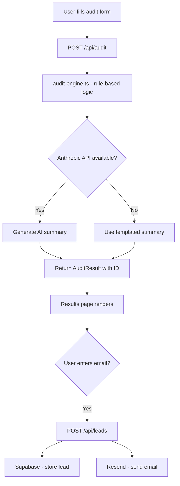

# Architecture

## System Diagram

## Data Flow
1. User selects tools, plans, spend on `/audit`
2. Form state persisted to `localStorage` on every change
3. On submit → `POST /api/audit` with `{ tools, teamSize, useCase }`
4. `runAudit()` evaluates each tool with hardcoded rules
5. Anthropic API called for ~100-word summary (fallback if unavailable)
6. Result stored in memory with nanoid ID, returned to client
7. Client redirects to `/audit/results?id=XXX`
8. Results page fetches `GET /api/audit?id=XXX`
9. User can share URL or submit email for lead capture

## Stack
- **Framework**: Next.js 16 (App Router) — colocated API routes, RSC-ready
- **Language**: TypeScript — type safety across audit engine and API
- **Styling**: Tailwind CSS + inline styles — utility classes for layout, inline for dynamic values
- **Database**: Supabase (Postgres) — lead capture storage
- **Email**: Resend — transactional audit report emails
- **AI**: Anthropic Claude API — personalized summary only
- **Deploy**: Vercel — zero-config Next.js deployment
- **CI**: GitHub Actions — lint + test on every push

## Scaling to 10k Audits/Day
- Move in-memory audit store to Redis (Upstash) with 24h TTL
- Add Supabase row for every completed audit (not just leads)
- Rate limit `/api/audit` per IP using Upstash Ratelimit
- Cache Anthropic API responses for identical inputs
- Move AI summary generation to a background job (Inngest/QStash)