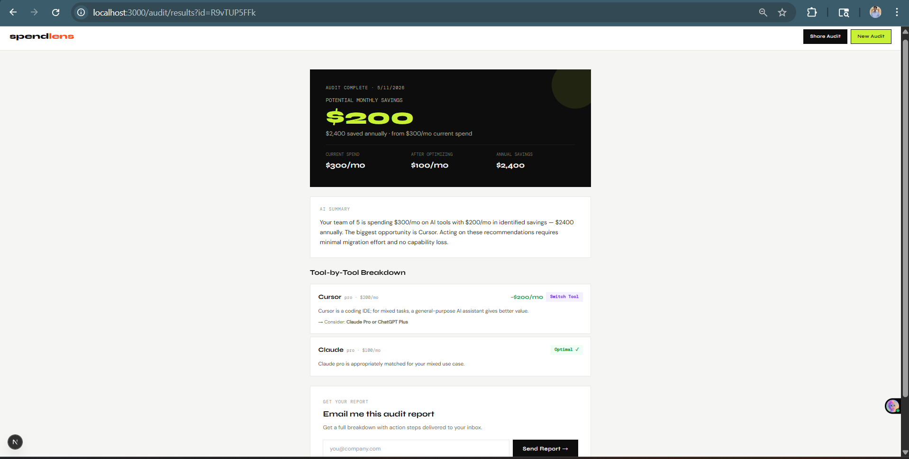

# SpendLens — Free AI Spend Audit for Startups

SpendLens is a free web tool that audits a startup's AI tool spending 
and surfaces specific, defensible savings recommendations. Built for 
engineering managers and CTOs who pay AI bills without benchmarking them.
Built as a lead-generation asset for [Credex](https://credex.rocks).

## Live URL
🔗 [https://spendlens-woad.vercel.app](https://spendlens-woad.vercel.app)

## Screenshots
> Add 3 screenshots here after deployment works




## Quick Start

### Run Locally
```bash
git clone https://github.com/rishi23200-oss/spendlens
cd spendlens
npm install
cp .env.local.example .env.local  # fill in your keys
npm run dev
```

Open [http://localhost:3000](http://localhost:3000)

### Environment Variables
Create `.env.local` at root:

| Variable | Description |
|----------|-------------|
| `NEXT_PUBLIC_SUPABASE_URL` | Your Supabase project URL |
| `NEXT_PUBLIC_SUPABASE_ANON_KEY` | Your Supabase anon key |
| `SUPABASE_SERVICE_ROLE_KEY` | Your Supabase service role key |
| `ANTHROPIC_API_KEY` | Anthropic API key for AI summaries |
| `RESEND_API_KEY` | Resend API key for transactional emails |
| `NEXT_PUBLIC_APP_URL` | https://spendlens-woad.vercel.app |

### Deploy to Vercel
1. Push to GitHub
2. Import repo on vercel.com
3. Add environment variables in Vercel dashboard
4. Deploy

### Run Tests


## Decisions

**1. Next.js App Router over Pages Router**
App Router gives colocated API routes, better layout system and 
RSC support. Pages Router would have worked but App Router is the 
future direction of Next.js.

**2. Hardcoded rules for audit logic — not AI**
Audit math needs to be deterministic and defensible. A finance 
person should read the reasoning and agree with it. AI is only 
used for the 100-word summary paragraph — knowing when NOT to 
use AI is part of the design.

**3. In-memory audit store instead of immediate Supabase**
Reduces latency, avoids DB round-trips for anonymous users. 
Supabase is used only for lead capture, keeping the MVP simple 
and fast.

**4. Replaced nanoid with inline ID generator**
nanoid v5 is ESM-only and breaks Jest's CommonJS pipeline. 
A simple 6-line inline function generates IDs with same entropy, 
zero dependency overhead.

**5. Email captured after value shown — never before**
Users who see their savings first are significantly more likely 
to submit email. Requiring login upfront kills top-of-funnel 
conversion — this is standard pattern for free audit tools.